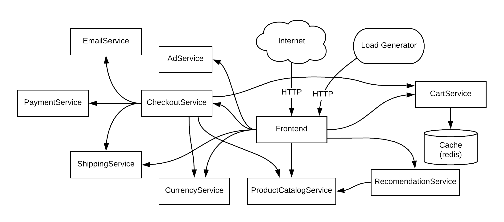

## Install the UP9 CLI
`npm i -g -s up9`{{execute}}

Make sure UP9 was installed correctly
`up9`{{execute}}

## Install a demo application
`git clone https://github.com/microservices-demo/microservices-demo`{{execute}}

## Deploy UP9 on the demo application

First, we need to change directory to where your docker-compose file is.

`cd microservices-demo/deploy/docker-compose`{{execute}}

UP9 can cerate a configuration file for yourDocker-Compose setup. 

`up9 tap:create-docker-compose $WORKSPACE`{{execute}}

The command above just created a new file named docker-compose-up9.yml
See this file using the editor

`docker-compose-up9.yml`{{open}}

Now to run the setup 

`docker-compose -f docker-compose.yml -f docker-compose-up9.yml up`{{execute}}

See the name of the workspace we'll use: 

`echo $WORKSPACE`{{execute}}

You can view teh demo app in this link: https://[[HOST_SUBDOMAIN]]-80-[[KATACODA_HOST]].environments.katacoda.com

## Running a load test

Let's inject some traffic by running a load test.

`docker run --net=host weaveworksdemos/load-test -h localhost -r 100 -c 2`{{execute}}

seeing the results
Installing UP9 on ypour cluster

This tutorial is good if you want to see UP9 in action, but don'e have a Kubernetes cluster handy. The following few steps will guide you throuhg installing UP9 on a Minkube cluster running a demo applicatoin.

# The Demo Application

This tutorial uses the [Online Boutique demo application by Google](https://github.com/GoogleCloudPlatform/microservices-demo) includes about 10 services communicating over gRPC.

The application is already installed on this envirnoment and is accessible using this link: https://[[HOST_SUBDOMAIN]]-80-[[KATACODA_HOST]].environments.katacoda.com/

You can use kubectl that the application pods are under the default namespace: 

`kubectl get pods -A`{{execute}}
