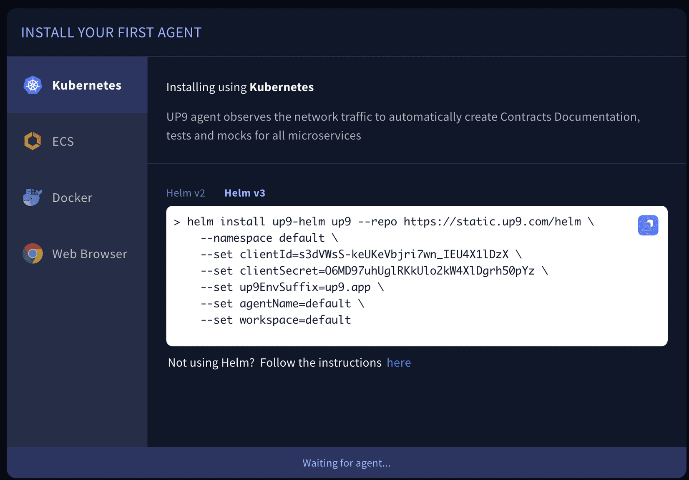
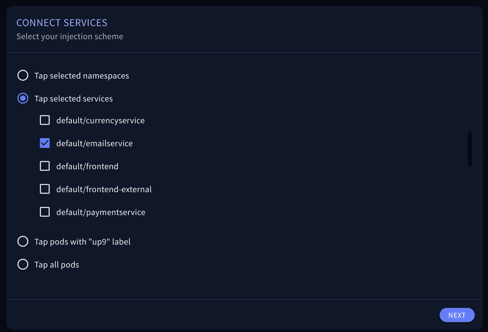

## Sign up

If you haven't signed up to UP9, please do so using this link: https://up9.app/signup.

## Install

Copy the Helm command that appears first thing after installation to this terminal. 

Once UP9 is installed, you should see two UP9 pods under the up9 namespace:

`kubectl get pods -A`{{execute}}

Once the UP9 pods are ready, your screen will change to allow you to choose the services or namespaces to instrument. Please do so and save your configuration.

Now restart the application's services by doing a rolling restart to the application deploymenets:

`kubectl rollout restart deployments -n default`{{execute}}
